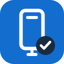
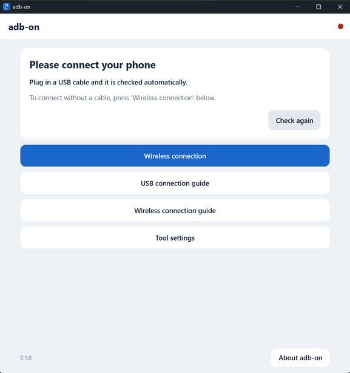

<p align="center"><em><a href="README.md">English</a> ∙ <a href="README-zh-Hans.md">简体中文</a> ∙ <a href="README-ja.md">日本語</a> ∙ <a href="README-es.md">Español</a> ∙ <a href="README-ko.md">한국어</a> ∙ <a href="README-de.md">Deutsch</a> ∙ <a href="README-fr.md">Français</a></em></p>

<br>

<div align="center">
  
  <h1>adb-on</h1>
  <p><strong>Conecta tu teléfono desde una sola ventana.</strong></p>
  <p>Una herramienta de escritorio pequeña y sencilla para conectar un teléfono Android sin abrir la terminal.</p>
  <p>Funciona en Windows. La compilación para macOS está en preparación.</p>
</div>

> **Versión para Windows disponible.** Descarga `adb-on-windows-x64.zip` desde Releases, descomprímelo y abre `adb-on.exe`. La conexión con un teléfono real se ha verificado por USB y Wi-Fi. Las compilaciones para macOS aún no se publican.

<p align="center"></p>

**Lo que se busca es simple.** Abre la aplicación y conecta el teléfono. adb-on se encarga de lo que hay que hacer en el PC y te indica en cada momento lo que debes pulsar en el teléfono.

<br>

## Índice

- [¿Por qué adb-on?](#por-qué-adb-on)
- [Descarga y estado de soporte](#descarga-y-estado-de-soporte)
- [Primera conexión por USB](#primera-conexión-por-usb)
- [Conectar sin cable](#conectar-sin-cable)
- [La próxima vez que te conectes](#la-próxima-vez-que-te-conectes)
- [Consulta rápida cuando algo falla](#consulta-rápida-cuando-algo-falla)
- [¿Qué hace automáticamente?](#qué-hace-automáticamente)
- [Criterios para ser pequeño y rápido](#criterios-para-ser-pequeño-y-rápido)
- [¿Qué queda en mi PC?](#qué-queda-en-mi-pc)
- [Preguntas frecuentes](#preguntas-frecuentes)
- [Exención de responsabilidad](#exención-de-responsabilidad)
- [Informar de problemas y condiciones de uso](#informar-de-problemas-y-condiciones-de-uso)
- [Referencias oficiales](#referencias-oficiales)

<br>

## ¿Por qué adb-on?

¿Creaste una aplicación Android y te quedaste atascado justo al conectarla a tu teléfono?

Buscar dónde está instalado `adb`, copiar comandos y volver a escribir el puerto que cambió no es la parte esencial de crear una aplicación. adb-on reúne en una ventana pequeña solo lo necesario para la conexión.

- **USB con comprobación automática:** distingue entre conectado, esperando la aprobación del teléfono y sin respuesta.
- **Inalámbrico guiado:** selecciona la dirección detectada e introduce el código de 6 dígitos del teléfono. Si la detección automática no funciona, puedes escribir la dirección manualmente.
- **Paso a paso la primera vez:** te guía desde las opciones para desarrolladores hasta el botón de permitir en el teléfono.
- **Compatible con tus herramientas actuales:** usa el servidor ADB predeterminado. No cierra el servidor existente de forma incondicional ni borra las claves de autenticación.
- **Solo las funciones necesarias:** se centra en la conexión, sin servidores en la nube, duplicación de pantalla ni administrador de archivos.

<br>

## Descarga y estado de soporte

Ubicación oficial de distribución: [Descargas y versiones de adb-on](https://github.com/cj-tinygem/adb-on/releases)

|Plataforma|Formato|Estado actual|
|---|---|---|
|Windows x64|`adb-on.exe`|Disponible. Verificado con un teléfono real por USB y Wi-Fi. El emparejamiento con código aún espera verificación con teléfono real.|
|macOS Apple Silicon|`adb-on.app`|Aún no publicado. Ruta de compilación preparada, sin verificar en un Mac real.|
|macOS Intel|`adb-on.app`|Aún no publicado. Ruta de compilación preparada, sin verificar en un Mac real.|

- No hay instalador. Descomprime el archivo, coloca el único `adb-on.exe` en cualquier carpeta y ejecútalo. Los archivos de licencia del zip no son necesarios para ejecutar la aplicación.
- La aplicación de Windows no requiere WebView2, Node.js ni Java.
- El idioma de la aplicación sigue al del PC al principio. En Ajustes de herramientas puedes cambiar entre English, 简体中文, 日本語, Español, 한국어, Deutsch y Français.
- Si ADB ya está presente, se reutiliza. Si no, la aplicación prepara la herramienta oficial de Google tras aceptar las condiciones. La preparación inicial requiere conexión a Internet.
- La compilación de desarrollo actual no es una distribución con firma de código ni notarización oficiales. No omite automáticamente las advertencias del sistema operativo ni modifica la configuración de seguridad.
- La versión mínima objetivo de macOS es la 12. El rango de compatibilidad real se confirmará tras la verificación nativa.
- Actualmente no se ofrece soporte nativo para Linux ni Windows ARM.

Cada versión incluye la **suma de comprobación SHA-256** del ejecutable junto con el alcance de la verificación. Consulta las notas de la versión para no confundir una compilación de prueba de desarrollo con una versión con soporte oficial.

<br>

## Primera conexión por USB

### 1. Abre adb-on

Si aparece el aviso de que no hay ADB, pulsa **Preparar la primera conexión**. Revisa y acepta las condiciones del SDK de Google; la aplicación descargará y preparará los archivos oficiales.

Si Android Studio ya está instalado, normalmente este paso se omite. Si instalaste las herramientas en otra ubicación, puedes seleccionar `adb.exe` o `adb` en **Configuración de herramientas → Seleccionar un archivo ADB existente**.

### 2. Abre las opciones para desarrolladores en el teléfono

|Teléfono|Menú a seguir|
|---|---|
|Galaxy|Ajustes → Información del teléfono → Información de software → pulsar 7 veces **Número de compilación**|
|Pixel y otros|Ajustes → Información del teléfono → pulsar 7 veces **Número de compilación**|

Si se solicita la contraseña de bloqueo, introdúcela **directamente en el teléfono**. Los nombres de los menús pueden variar según el modelo y la versión de Android.

### 3. Activa la depuración por USB

Activa **Opciones para desarrolladores → Depuración por USB** en los ajustes del teléfono. Por la seguridad de Android, este paso debe hacerse directamente en el teléfono.

### 4. Conecta con un cable de datos y permite el acceso

Desbloquea el teléfono y pulsa **¿Permitir depuración por USB? → Permitir**. Si es tu propio PC, marcar «Permitir siempre» facilitará las próximas conexiones.

Cuando adb-on cambie a **Conectado**, selecciona el teléfono en la herramienta de desarrollo de este PC.

> Los cables que solo permiten la carga no sirven para la conexión ADB. No se aprueba a la fuerza desde el PC un teléfono que no haya dado permiso.

<br>

## Conectar sin cable

Se usa la depuración inalámbrica, disponible en Android 11 o superior.

### 1. Conéctate a la misma red Wi-Fi

El PC y el teléfono deben estar en una red que permita la comunicación entre ambos. Las redes Wi-Fi de empresas, centros educativos o de invitados pueden bloquear la comunicación entre dispositivos.

### 2. Abre la pantalla de vinculación en el teléfono

Selecciona **Ajustes → Opciones para desarrolladores → Depuración inalámbrica → Vincular dispositivo con código de vinculación**. Deja esta pantalla abierta.

### 3. Pulsa Conexión inalámbrica en adb-on

Pulsa la dirección de vinculación detectada, introduce el **código de 6 dígitos** que aparece en el teléfono y pulsa **Vincular**. Si solo se detecta una dirección, se rellena automáticamente. Si aparecen varios teléfonos, compárala con la dirección que muestra la pantalla de tu teléfono.

La detección automática continúa durante un tiempo. Si no encuentra nada, puedes introducir manualmente la **dirección IP:puerto** que muestra el teléfono.

### 4. Comprueba el estado de la conexión

La vinculación es el proceso que registra el PC como de confianza; no equivale a completar la conexión.

Si no se conecta, retrocede una pantalla en el teléfono, introduce la **dirección IP y el puerto de la pantalla principal de Depuración inalámbrica** en el campo de conexión de adb-on y pulsa **Conectar**.

|Dirección|¿Dónde está?|¿Dónde se introduce?|
|---|---|---|
|Dirección de vinculación|Ventana emergente «Vincular dispositivo con código de vinculación»|① Campo de dirección de vinculación|
|Dirección de conexión|Pantalla principal de Depuración inalámbrica|② Campo de dirección de conexión|

**Los dos puertos son distintos.** Por ejemplo, la vinculación puede ser `192.168.1.5:37123` y la conexión `192.168.1.5:39511`. No copies el ejemplo; usa los valores de tu teléfono.

<br>

## La próxima vez que te conectes

- **USB:** si el PC ya es de confianza, conecta el cable y comprueba el estado. Si se vuelve a pedir la aprobación, permítela en el teléfono.
- **Inalámbrico:** se vuelve a conectar si la depuración inalámbrica está activada en la misma red y ADB detecta el dispositivo. Si la conexión automática falla, usa la **dirección de conexión actual** del teléfono.
- **Tras reiniciar o cambiar de Wi-Fi:** la depuración inalámbrica puede desactivarse o la IP y el puerto pueden cambiar. adb-on no guarda direcciones obsoletas para seguir intentándolo.
- **Cierre de la aplicación:** al cerrar la ventana, adb-on finaliza. El servidor ADB y las conexiones que usan otras herramientas de desarrollo se mantienen. No hay ningún servicio residente oculto de adb-on.
- **Desconexión inalámbrica:** pulsa el botón de desconectar del dispositivo correspondiente. Como ADB puede reconectarse automáticamente, desactiva la depuración inalámbrica en el teléfono si quieres asegurarte de cortar la conexión.

<br>

## Consulta rápida cuando algo falla

|Situación|Qué hacer primero|
|---|---|
|Esperando aprobación en el teléfono|Desbloquear el teléfono y revisar la ventana emergente de permiso de depuración por USB|
|El USB está conectado pero el teléfono no aparece|Comprobar en este orden: cable de datos, otro puerto, depuración por USB|
|Sigue sin aparecer en Windows|Consultar la [guía de controladores USB del fabricante](https://developer.android.com/studio/run/oem-usb)|
|No se detecta el dispositivo inalámbrico|Dejar abierta la ventana emergente de vinculación o introducir la dirección manualmente|
|Se rechaza el código de vinculación|Abrir una nueva ventana emergente de vinculación en el teléfono e introducir el nuevo código y la nueva dirección|
|Vinculado pero sin conexión|Conectar con la **dirección de conexión** de la pantalla principal de Depuración inalámbrica|
|No funciona en la Wi-Fi de la empresa|La comunicación puede estar bloqueada aunque sea la misma red. Usar la conexión USB|
|Aviso de otra versión del servidor ADB|Seleccionar el mismo archivo ADB que usa la herramienta de desarrollo|
|La herramienta de desarrollo no encuentra el teléfono|Comprobar que usa el servidor ADB predeterminado del mismo entorno de PC. WSL es un entorno aparte|
|Fallo al descargar ADB|Conectarse a Internet y volver a preparar, o seleccionar un archivo ADB existente|

En la sección **Guía de conexión USB** dentro de la aplicación puedes ver las mismas indicaciones paso a paso. Una lista de dispositivos vacía no basta para determinar si la causa es el controlador, el cable o la configuración del teléfono.

<br>

## ¿Qué hace automáticamente?

|Lo que se procesa en el PC|Lo que debes hacer directamente en el teléfono|
|---|---|
|Buscar el ADB existente y comprobar el estado de la conexión|Activar las opciones para desarrolladores y la depuración por USB o inalámbrica|
|Descargar el ADB oficial tras aceptar las condiciones y verificar los archivos|Aprobar por primera vez la confianza en el PC|
|Detectar direcciones inalámbricas, ejecutar el comando de vinculación y solicitar la conexión|Abrir la pantalla de vinculación y comprobar el código de 6 dígitos|
|Indicar el siguiente paso según el estado|Resolver problemas de permisos del teléfono, como políticas de administración corporativa|

No se ofrece duplicación de pantalla, administración de archivos, compilación de aplicaciones, rooteo ni instalación automática de controladores.

<br>

## Criterios para ser pequeño y rápido

No se afirma el rendimiento solo por tener un ejecutable pequeño. Antes de cada distribución se miden los siguientes puntos.

- Tiempo desde la ejecución hasta que se muestra la ventana.
- CPU y memoria en reposo. El servidor ADB compartido existente se contabiliza por separado.
- Tamaño del ejecutable y de la descarga inicial.
- Actualización del estado al conectar o desconectar el teléfono y respuesta de la pantalla durante el uso.

La GUI está construida con **Rust + Slint** y no carga el WebView del sistema. Los cambios de estado usan las notificaciones de ADB, y la consulta de detección inalámbrica solo se ejecuta durante un tiempo limitado cuando el usuario abre la conexión inalámbrica.

Medición real de la compilación de desarrollo en Windows (sin teléfono conectado, 2026-09-11):

|Elemento|Resultado|
|---|---|
|Ejecutable|Aprox. 12.0MiB|
|Memoria en reposo|Aprox. 126MiB de conjunto de trabajo, aprox. 59MiB privados (dibujo por GPU; la mayor parte del conjunto de trabajo es memoria del controlador gráfico)|
|Aparición de la ventana en tres reinicios|0.47~0.57 segundos|
|Servidor ADB compartido|Aprox. 4.7MiB por separado, se mantiene el proceso existente|

En cada ejecución, 30 segundos en reposo consumieron 0.13~0.36 segundos de tiempo de CPU (aprox. 0.4~1.2% de un núcleo). Desde esta compilación la ventana se dibuja con la GPU; el dibujo por software de las preguntas frecuentes usa aprox. 30MiB, pero el desplazamiento es menos fluido. La primera ejecución de la compilación inicial anterior tardó 1.43 segundos, y no se garantiza el mismo resultado en un arranque en frío ni en otros PC. La carga durante la conexión de dispositivos y el rendimiento en macOS aún no se han verificado.

<br>

## ¿Qué queda en mi PC?

- La configuración con la ubicación de ADB (`settings.json`) y, si elegiste la preparación desde la aplicación, una copia del ADB oficial. Ambos se encuentran únicamente en la carpeta indicada a continuación.
  - Windows: `%LOCALAPPDATA%\tinygem\adb-on\data\`
  - macOS: `~/Library/Application Support/ai.tinygem.adb-on/`
- Las claves de autenticación del PC y el servidor que gestiona el propio ADB. adb-on no elimina ni sustituye las claves existentes.

Los códigos de vinculación no se guardan en la configuración ni en los registros de uso. No hay ningún servidor de almacenamiento remoto. Durante la preparación automática se accede al servidor de descargas de Google, y los enlaces de ayuda se abren en el navegador predeterminado.

Para dejar de usar la aplicación, elige **Ajustes de herramientas → Eliminar datos de adb-on**, luego cierra la ventana y elimina el ejecutable. Si ya eliminaste el ejecutable, elimina tú mismo la carpeta indicada arriba. Si el ADB preparado aquí se está ejecutando como servidor, se detiene durante la eliminación; el ADB de otras herramientas y las claves de autenticación de ADB no se tocan. Eliminar solo el ejecutable no elimina esta carpeta.

<br>

## Preguntas frecuentes

### ¿Es necesario instalarlo?

No. Coloca el único `adb-on.exe` en cualquier carpeta y ejecútalo. La configuración y el ADB preparado se guardan en la carpeta de datos del usuario indicada arriba y pueden eliminarse desde Ajustes de herramientas.

### ¿Es de código abierto?

Sí. El código fuente se publica bajo la licencia MIT. Los componentes de terceros se rigen por sus respectivas licencias.

### ¿Necesito conocer ADB?

Para la conexión básica no se necesitan comandos. Las aprobaciones y ajustes que deben hacerse en el teléfono se indican en pantalla.

### ¿Puedo desarrollar aplicaciones sin Android Studio?

adb-on es una herramienta de conexión. No sustituye al SDK ni a las herramientas de compilación necesarias para crear una aplicación.

### Si me conecto desde Windows, ¿funciona también en WSL?

No se transfiere automáticamente. Windows y WSL pueden ser entornos de desarrollo distintos.

### ¿En macOS se admiten tanto Intel como Apple Silicon?

Las rutas de compilación para ambas arquitecturas están preparadas, pero todavía no se publica ninguna compilación para macOS ni se ha verificado en un Mac real. Cuando se publique, no llevará firma de Apple Developer ID, así que la primera apertura necesitará clic derecho → Abrir, una sola vez.

### ¿Se instala alguna aplicación adicional en el teléfono?

adb-on no instala ninguna aplicación adicional en el teléfono para la conexión. Utiliza la función de depuración de Android.

<br>

## Exención de responsabilidad

adb-on es software de código abierto publicado bajo la licencia MIT. El texto de la licencia en [LICENSE.txt](LICENSE.txt) constituye las condiciones vinculantes; los puntos siguientes lo reformulan en lenguaje sencillo.

- **Sin garantía.** El software se proporciona «tal cual», sin garantía de ningún tipo, expresa o implícita. No se garantiza que se ajuste a un fin determinado ni que funcione sin errores.
- **Sin responsabilidad.** Los desarrolladores y colaboradores no son responsables de ningún daño derivado del uso, o de la imposibilidad de uso, de este software. Esto incluye la pérdida de datos, el mal funcionamiento del dispositivo, las conexiones fallidas, la interrupción de la actividad y cualquier otro daño directo o indirecto. Si lo usas y cómo lo usas es exclusivamente tu propia decisión y responsabilidad.
- **Tú gestionas los riesgos de las opciones para desarrolladores.** Las opciones para desarrolladores y la depuración por USB o inalámbrica son funciones de Android. Mientras están activadas, un PC conectado puede controlar el teléfono. No las actives en PC o redes en los que no confíes, y desactívalas cuando termines. adb-on no gestiona estos ajustes por ti.
- **Las herramientas de terceros se rigen por sus propias condiciones.** ADB forma parte de Android SDK Platform-Tools de Google y se proporciona bajo las condiciones de Google. adb-on no acepta esas condiciones en tu nombre. Los demás componentes se rigen por las licencias indicadas en [Avisos de terceros](THIRD-PARTY-NOTICES.md).
- **Sin afiliación con Google.** adb-on no está afiliado, patrocinado ni respaldado por Google ni por Android. Android es una marca comercial de Google LLC.
- **Sin compromiso de soporte.** Las funciones pueden cambiar o la distribución puede cesar sin previo aviso. No se prometen actualizaciones, resolución de problemas ni compatibilidad continuada.
- **Se aplica en la medida en que la ley lo permita.** Estas limitaciones no se aplican a la responsabilidad que la legislación aplicable no permita excluir.

### La ventana se ve mal o el desplazamiento va a tirones por Escritorio remoto

adb-on dibuja con la GPU de forma predeterminada y cambia por sí solo al dibujo por software cuando el controlador gráfico no ofrece OpenGL. Si la ventana sigue viéndose mal, o va lenta en una sesión de Escritorio remoto o en una máquina virtual, inícielo forzando el dibujo por software:

```
cmd /c "set SLINT_BACKEND=winit-software && adb-on.exe"
```

Ejecútelo en la carpeta donde está adb-on.exe. No se escribe nada en el disco. En macOS, defina la misma variable de entorno en Terminal antes de abrir la aplicación.

<br>

## Informar de problemas y condiciones de uso

Indica lo siguiente en [Informar de un problema](https://github.com/cj-tinygem/adb-on/issues).

- Sistema operativo del PC, modelo del teléfono y versión de Android.
- Si el método es USB o inalámbrico.
- En qué paso aparece qué mensaje.

**No envíes códigos de vinculación, claves de autenticación del PC ni datos personales.** Oculta también los datos personales en las capturas de pantalla.

[Licencia](LICENSE.txt) · [Avisos de terceros](THIRD-PARTY-NOTICES.md) · Hecho por cj en tinygem

<br>

## Referencias oficiales

- [Documentación oficial de Android ADB](https://developer.android.com/tools/adb)
- [Ejecutar aplicaciones en un dispositivo real](https://developer.android.com/studio/run/device)
- [Platform-Tools oficiales](https://developer.android.com/tools/releases/platform-tools)
- [Controladores USB de fabricantes para Windows](https://developer.android.com/studio/run/oem-usb)
- [Slint](https://slint.dev)

<p align="center"><a href="https://slint.dev"></a></p>

La estructura de este documento toma como referencia continua el índice, las explicaciones visuales y la navegabilidad de [System Design Primer](https://github.com/donnemartin/system-design-primer). De acuerdo con el propósito de adb-on, ofrece a la vez una ruta de inicio breve y una resolución de problemas detallada.
